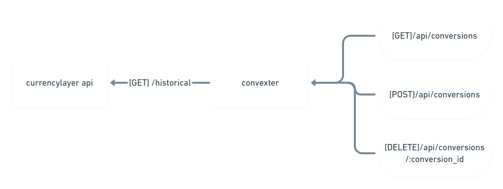
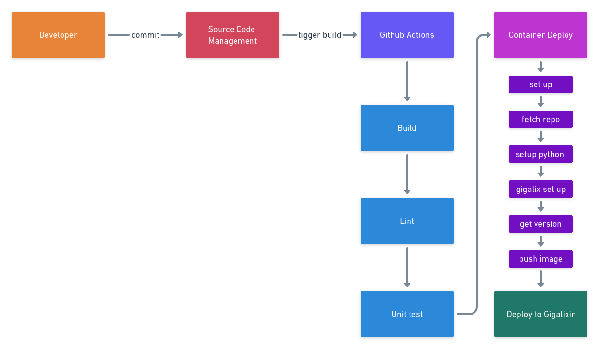

# Convexter


Convexter is a simple currency conversion API.

## Use case

Implementation of a Rest API for conversion between a pair of currencies using the external currencylayer service.

Requiments:

  1. Must be able to use the free version of the currencylayer api
  2. The base coin from the API is the USD
  3. Transactions should persist in the database having the following schema in the `[POST]/conversion`:
      * `user_id`
      * `origin_currency`
      * `target_currency`
      * `conversion_tax`
      * `timestamps`
  4. The success transaction must have the following response:
  ```json
  {
      "transactionId": "value",
      "userId": "value",
      "originCurrency": "value",
      "targetCurrency": "value",
      "originValue": 0.00,
      "targetValue": 0.00,
      "conversionTax": 0.000,
      "conversionDateTime": "0000-00-00 00:00:00.000000",
      "total_value": "0.00"
  }
  ```
  5. Besides an endpoint to create a conversion, the following endpoints should exist:
      * `[GET]/conversions`
      * `[GET]/conversions/:user_id`
    
---
**NOTE**

One of the new implementations of the api it's the `conversion_tax` that is the tax of the given conversion on top of the external API, in an example, the conversion from 10 USD to BRL is 100 BRL, but the conversion tax is 0.10 (10%), the total value will be 110 BRL.

---

## Information
### API
The API uses the following schema as a service to get a new conversion from the external API

<p align="center">
    
</p>

### CI/CD
Since this repo uses the free version of gigalixir which has a small pool size, the migrations are not used in github actions and instead should be run manually by the command `gigalixir ps:migrate -a $APP_NAME`, after any deploys with new migrations you should wait for the full deploy cycle and run the command above.

The repo uses the following schema as a CI/CD for new merges into master

<p align="center">
    
</p>

## Demo
The demo of this application can be found deployed at [Gigalixir](https://www.gigalixir.com/), it's using the Free Tier version, the app url can be found at `https://convexter.gigalixirapp.com/`.

In the [Insomnia_collection.json](Insomnia_collection.json) you can change the enviroment to `gigalixir` and try it out.

## Installation

To start your Convexter server:

  * Clone this repository with `git clone https://github.com/er-jpg/convexter.git`
  * Edit `.env.example` to use your [currencylayer](https://currencylayer.com/dashboard) API Access Key
  * Rename `.env.example` to `.env`
  * Export your enviroment to bash using `export $(cat .env | sed 's/#.*//g' | xargs)`
  * Install dependencies with `mix deps.get`
  * Create and migrate your database with `mix ecto.setup`
  * Start Phoenix endpoint with `mix phx.server` or inside IEx with `iex -S mix phx.server`


## Usage

Import the [Insomnia](https://insomnia.rest/) colletion in [Insomnia_collection.json](Insomnia_collection.json) and run the endpoints with the given examples.

### Tests and Lint
### Tests
To run tests in your application:

  * Run `mix test`

### Test coverage
To check test coverage in code:

  * Run `mix coveralls`

The current test coverage in the application is

```
COV    FILE                                        LINES RELEVANT   MISSED
  0.0% lib/convexter.ex                                9        0        0
 80.0% lib/convexter/application.ex                   41        5        1
100.0% lib/convexter/currencylayer_api.ex             13        1        0
  0.0% lib/convexter/currencylayer_api/behaviou        4        0        0
  0.0% lib/convexter/mailer.ex                         4        0        0
  0.0% lib/convexter/repo.ex                           5        0        0
 65.0% lib/convexter/transaction.ex                  159       20        7
 93.3% lib/convexter/transaction/convert.ex           56       15        1
  0.0% lib/convexter_web.ex                           78        1        1
 81.8% lib/convexter_web/controllers/convert_co       39       11        2
 50.0% lib/convexter_web/controllers/fallback_c       24        2        1
  0.0% lib/convexter_web/endpoint.ex                  48        0        0
  0.0% lib/convexter_web/gettext.ex                   24        0        0
 80.0% lib/convexter_web/router.ex                    45        5        1
 80.0% lib/convexter_web/telemetry.ex                 72        5        1
100.0% lib/convexter_web/views/changeset_view.e       19        2        0
100.0% lib/convexter_web/views/convert_view.ex        26       12        0
 66.7% lib/convexter_web/views/error_helpers.ex       33        3        1
100.0% lib/convexter_web/views/error_view.ex          16        1        0
  0.0% test/support/channel_case.ex                   36        3        3
100.0% test/support/conn_case.ex                      39        3        0
 50.0% test/support/data_case.ex                      51        6        3
100.0% test/support/fixtures/transaction_fixtur       25        2        0
[TOTAL]  77.3%
```

### Lint
Run code analysis with strict mode:

  * Run `mix credo`


### TODO
Points to be refactored

  * ~~user_id param in `[GET]/conversions/:user_id` should be a query param~~
  * ~~diagram of the API concept in `README`~~
  * ~~CI/CD diagram of the application~~
  * ~~more explict desciption of new features~~
  * ~~remove logic from view~~

## Learn more

  * Official website: https://www.phoenixframework.org/
  * Guides: https://hexdocs.pm/phoenix/overview.html
  * Docs: https://hexdocs.pm/phoenix
  * Forum: https://elixirforum.com/c/phoenix-forum
  * Source: https://github.com/phoenixframework/phoenix

---

[Back to top](#)